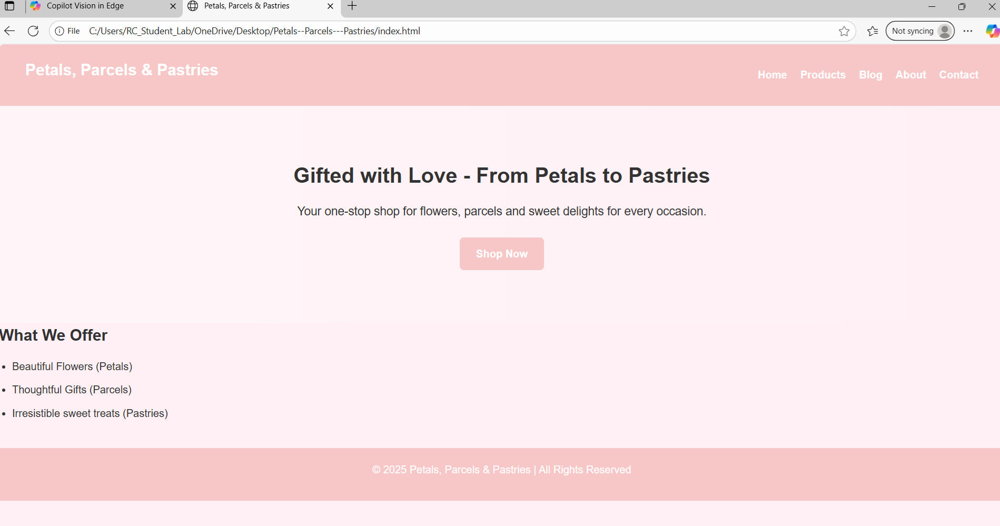
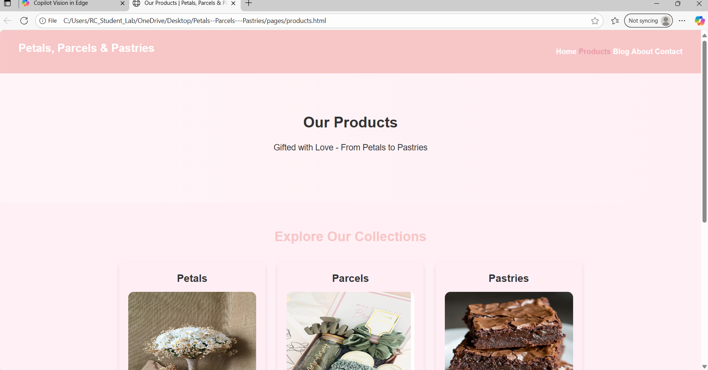
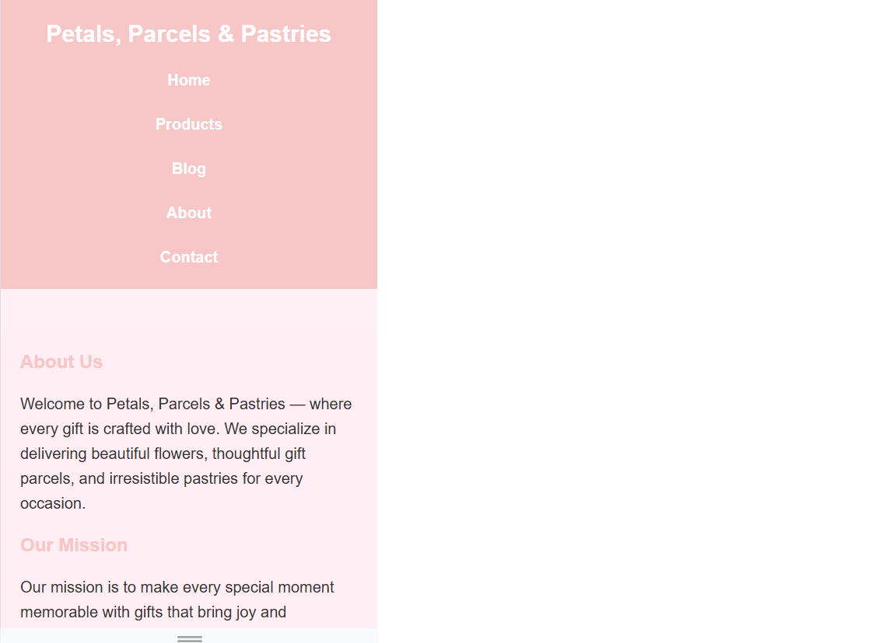
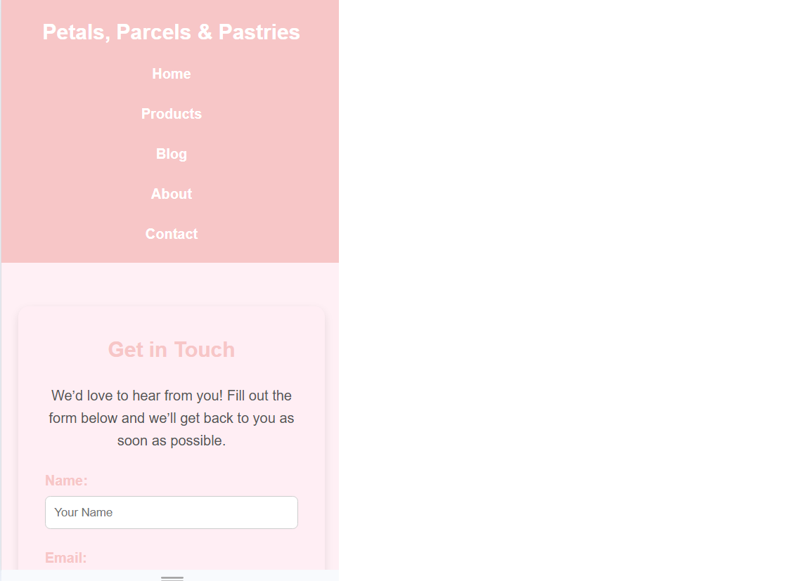

# Petals, Parcels & Pastries
# POE Part 2

## Project Overview
*Petals, Parcels & Pastries* is a boutique business offering a unique blend of floral arrangements (petals), curated gift boxes (parcels), and freshly baked sweet treats (pastries). The organization focuses on creating thoughtful and elegant gifting experiences by merging three joyful experiences into one.

The website targets individuals and organizations looking for memorable, locally sourced gifts for special occasions such as birthdays, anniversaries, weddings, corporate events, and seasonal events. Emphasis is placed on elegance, personalization, and sustainability.

The brand celebrates meaningful moments – whether surprising a loved one with fresh flowers, gifting a luxurious parcel, or indulging in handmade treats. With eco-friendly packaging and locally sourced ingredients and flowers, the website is designed for modern customers who value style, quality, and conscious living.

## Technologies Used
- *HTML5* – Page structure  
- *CSS3* – Styling, layout, and responsive design  
- *JavaScript* – Basic interactivity and responsive features  
- *Hosting* – Custom domain deployment  
- *Security Features* – HTTPS and spam protection for contact/checkout forms  

## Website Features
- *Home Page* – Hero section and overview of offerings  
- *About Page* – Company story and values  
- *Products Page* – Display of floral arrangements, gift boxes, and pastries  
- *Blog Page* – Updates, tips, and announcements  
- *Contact Page* – Contact form with spam protection  
- *Responsive Design* – Fully mobile-friendly with tablet and small mobile optimizations  
- *Navigation* – Header with links and hamburger menu for small screens  
- *Visual Elements* – High-quality images and consistent branding colors, and interactive hover states
- *Accessibility* - Focus outlines and navigation support  

## Installation / Usage
1. Clone or download the repository.  
2. Open index.html in a web browser.  
3. Navigate through the pages using the top navigation menu.  

## Screenshots
### Desktop View
![Home Page Desktop]  
![Products Page Desktop]   

### Mobile View
![About Page Mobile] 
![Contact Page Mobile]  

## Changelog
For all updates and version history, see the [Changelog](CHANGELOG.md)

## Author
- *Name:* Lerato Mabusela  
- *Student Number:* ST10494431  

## Notes
- Security features like HTTPS and spam protection are implemented.  
- The website allows for easy content updates via simple content management for products and blog posts.  
- Designed with user experience, accessibility, and mobile-first responsiveness in mind.
- Interactive elements use pseudo-classes like hover, focus, active and nth-child() for improved UX.
- Hamburger menu includes smooth open/close animations for mobile devices 

## Our Storyline
Petals, Parcels & Pastries is a boutique business offering handcrafted floral arrangements, curated gift parcels, and freshly baked pastries for personal and special occasions. Customers can enquire about pricing, custom orders, and delivery availability through the site.

## References
- Busch, Koch & Santiago (2014). Security Features in Web Development [https://link.springer.com/chapter/10.1007/978-3-319-07452-8_5]
- W3Schools. (2024). CSS Pseudo-classes Tutorial [https://www.w3schools.com/css/css_pseudo_classes.asp]
- MDN Web Docs. (2024). Responsive Design with Media Queries [https://developer.mozilla.org/en-US/docs/Learn/CSS/CSS_layout/Media_queries]
- FreeCodeCamp. (2024). Building a Responsive Navigation Menu [https://www.freecodecamp.org/news/responsive-navigation-bar-html-css/] 
- Canva. (2025). Pastel Color Inspiration for Web Design [https://www.canva.com/colors/color-palettes/pastel-dream/]